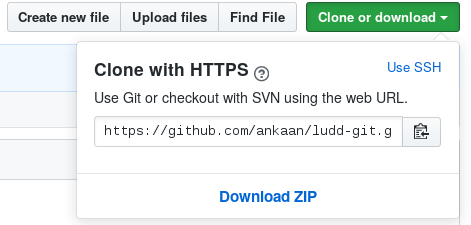
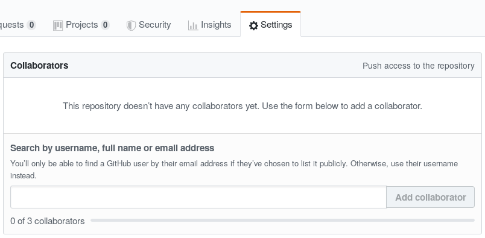
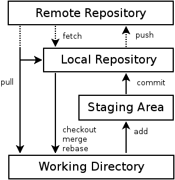

class: center, middle

# Introduction to Git

Anders Engström

<ankan@ludd.ltu.se>

9 November 2021

.left-column[]
.right-column[]

---
## In a world without version control
### How do you work in a group?

* Shared folder. (In cloud or on mainframe.)
* Mail files back and fourth. (All files or only changed ones?)
* Instant messaging.

### How do you undo changes?

* Create a copy in advance according to a naming convention.
* Search through old mails or IM conversations.
* Rewrite parts of the code so that it looks the same as before.

### Can you come up with more ways?

---
## Types of version control

### How do you handle multiple users?

* File locks
* Merge

### Where is the information stored?

* Centralized
* Distributed

---
## This is Git

### Git is:

* A fast distributed version control system. (Free backups!)
* Based on merging changes.
* Written for the Linux kernel (by Linus Torvalds et al.)
* Lots of other projects also use it.
* Git is open source, GPL etc.
* But also used in the industry!

### We will look at:

* Official command-line client. (Also available for Windows.)
    * The graphical clients mostly just gives you a fancy menu.
    * All the same concepts still apply.
* Github Website
* Some side tools that I personally use:
    * neovim/fugitive/nerdtree
    * meld

---
## Preparations

### Who are you?

```bash
git config --global user.name "Anders Engström"
git config --global user.email ankan@ludd.ltu.se
```

### Create a common storage area

* Many sites offer free hosting. (Github, Bitbucket, Ludd)
    * Create an account and a repository there.
* Or create your own on a server.
    * All you need is a directory all users can access.
* .strike[Or just use an USB-stick!] (Can be done, but would not recommend it.)

Using a server is actually optional.

---
## Set things up

* Create Github user at: http://github.com
* Create new repository. (Probably private, let it add the README.)
* Clone the repository:



* Run:
```bash
git clone https://github.com/ankaan/ludd-git.git
```

---
## Add collaborators



---
## Everyday use

### Which commands to you actually need to learn?

Command | Description
--------|------------
add     | Mark file for saving.
reset   | Unmark file for saving.
commit  | Save changes to the log.
status  | How does the git-repo look? What files have been changed?
push    | Send all committed changes to the shared repository.
pull    | Download all changes from the shared repository.
checkout | Get an old version of a file.
log     | Show a log over all commits made.
help    | Show the help for a certain command.

---
## How is data stored in git?



---
## How is committed data stored in git?

At a high level, each saved state is a commit, which contains:

* A commit message.
* An author
* Its predecessor state
* Your updated files.

Each commit is identified by a hash.

---
## Demonstration of the basic concepts

* Change files.
* Commit.
* Handle conflicts.
* Look in the log.

### A closer look at the history

Different ways of looking at the history:

Command | Description
--------|------------
log     | Show a log of all commits with their comments.
show    | Show details for a specific commit.
diff    | Compare different versions of files.
blame   | Show who last touched a certain row.

???
* Transfer data between users.
* Automatically merge nonconflicting changes.
* Create a conflict and resolve it.
* Git log
* Git show
* Git diff
* Git blame
---
## Undo

Undo can mean a lot of different things:

```bash
# While still coding
git checkout $file
git checkout 502cfb1 $file

# Prepared for a commit, but not yet committed (keep the change itself):
git reset HEAD $file

# Already commited, but not pushed (leave change staged):
git reset --soft HEAD~1

# Already pushed (create a commit that does reverts all changes):
git revert 502fcb1

# Help, my stuff is gone!
git reflog
git reset --hard 502fcb1
```

But in general: Leave your published errors in the history!

Though remember, the data is still there!

---
## More control while adding

```bash
# To review all changes while you are preparing a commit:
git add -p
```

---
## Tags

### What is a tag?

A named bookmark that points to a specific commit.

### Commands to handle tags:

```bash
git tag $name
git tag
git push --tags
```

---
## Branches and commits


.footnote[Image source: https://datasift.github.io/gitflow/IntroducingGitFlow.html]

---
## How to use branches

### Associated commands

Command | Description
--------|------------
branch  | Lists or create a new branch (`-r` to list remote branches)
checkout | Switch between branches (`-b $name` to create.)
merge   | Bring in changes from another branch.
rebase  | Pretend that we made our changes to a different branch.

### Branches are local by default

```bash
# Upload and follow:
git push --set-upstream origin $branch

# To follow a remote branch, first update the cache of what is on the server:
git pull
# Then create a local branch based on that cache:
git checkout $branch
```

---
## Merge

### An example of what merge does

```
      A---B---C topic
     /
D---E---F---G master (current)
```

Then perform the merge:
```bash
git merge topic
```

And the result will be:
```
      A---B---C topic
     /         \
D---E---F---G---H master (current)
```

---
## Rebase

### An example of what rebase does

```
      A---B---C topic (current)
     /
D---E---F---G master
```

Then perform the rebase:
```bash
git rebase master
# Or: git rebase master topic
```

And the result will be:
```
              A'--B'--C' topic (current)
             /
D---E---F---G master
```

---
## Force push

Sometimes you just have to replace what is on the server.

```bash
git push --force-with-lease
```

(Basically never use `git push --force`)

---
## Ignore files

### How do you get git to stop listing certain files?

Create a `.gitignore` file and list what should be ignored (wildcards are available.)

For example:
```
*.swp
.DS_Store
```

---
## Pull Requests / Merge Requests
Server side workflow to help with:
* Code reviews.
* Verify code before it is merged.

---
## What if I use Windows?

* msysgit (installs a shell and works just like on Linux.)
* There is also WSL now.
* Git Extensions (a GUI-application.)
* Built into your IDE (VSCode, Eclipse, IntelliJ Idea, PyCharm, etc.)
* There are GUI programs for other operating systems also.

---
## Summary

* What you need version control for.
* What git is.
* How to use git.
* Some of the most common problems you can encounter.

With all the data stored, there are lots of more things you can do.

---
## Bibliography and links

.right-side[]

These slides:
* https://ankaan.github.io/ludd-git/

Online hosting:
* http://buck.ludd.ltu.se
* http://gitlab.com
* http://github.com
* http://bitbucket.org

Guides:
* http://schacon.github.com/git/gittutorial.html
* .strike[http://ricroberts.com/articles/getting-to-grips-with-git-part-1-the-basics]

More information:
* http://en.wikipedia.org/wiki/Revision_control
* http://en.wikipedia.org/wiki/Git
